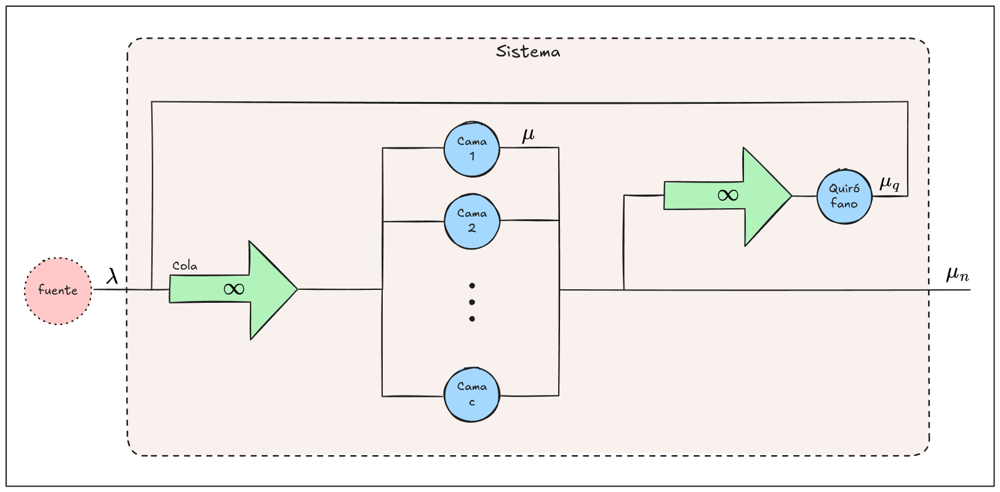
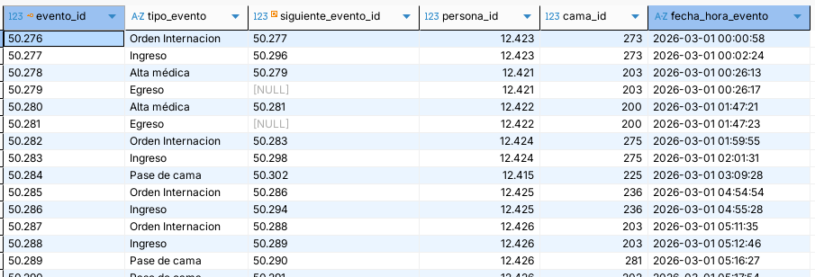
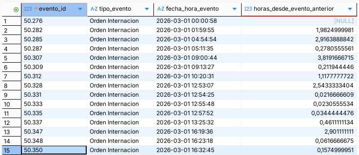

# Simulación: TP Final

Equipo:

- Aita Jerónimo
- Mactavish Tomás
- Rojas Francis

Docentes:

- Franco Lorena
- Bonesi Matías

---

## Trabajo en el repositorio

Documentado en [REPO](REPO.md)

---

## Consigna

Seleccionar un modelo o sistema que tenga varios servidores, que estén conectados en serie y en paralelo. Tendrán que contextualizar y explicar su funcionamiento.

El sistema considerado debe ser un sistema real del cual puedan demostrar y obtener los datos de las variables exógenas o bien obtener la información a través de alguna fuente pública de internet.

Antes de continuar con el resto del trabajo la idea deberá ser presentada y aprobada por la cátedra.

Fecha máxima de presentación de tema a aprobar 10-09-26.

La idea clave del trabajo integrador es que puedan aplicar todo lo que vamos a ir viendo en la materia de Simulación. Por lo tanto, a medida que avancemos en los temas, van a tener que ir presentando los avances.

## Sistema

Nuestro equipo propone trabajar sobre **la internación de pacientes en un hospital**.

Bajo el contexto de un centro de salud que presta servicio de hospitalización, el mismo posee un determinado conjunto finito de **camas**.

Cuando un médico considera que un paciente requiere hospitalización, genera una **orden de internación** para ese paciente. Esto habilita al personal de enfermería asignarlo a una cama entre las disponibles.

**De no haber camas disponibles**, el paciente retendría la orden de internación hasta que sea liberada una cama.

Los pacientes ocupan la cama a la que fueron asignados por un cierto periodo de tiempo, pudiendo ser horas o días.
También pueden ocurrir **pases de cama**, en caso de ser necesario trasladar al paciente de una habitación a otra.

Luego de cierto tiempo, el médico responsable emite un **alta**, que habilita al personal de enfermería registrar el **egreso** del paciente, dejando libre la cama que ocupaba.

Además, según el cuadro clínico del paciente, el médico puede indicar la necesidad de realizar una operación.
La misma requiere pasar al paciente de una cama (periodo de preparación pre-quirúrgica) al **quirófano**; una sala especial en la cual el paciente podría pasar entre minutos y horas.

Luego de la operación, el paciente volvería a una cama (periodo de reposo post-quirúrgico) hasta recibir el alta.

## Modelo

Para analizar este sistema, podemos modelarlo utilizando la **Teoría de colas** con las siguientes reglas:

- Un paciente es una entidad/cliente.
- El evento "orden de internación" es la llegada de un paciente al sistema. Queda encolado hasta que ocurre el evento "Ingreso", que lo ubica en una cama.
- Una cama es un servidor.
- Existe una cama especial llamada quirófano, en serie con todas las camas. Se llega al y se sale del quirófano mediante un evento "Pase de cama". Salir del quirófano implicaría volver a la cola original, pero siempre se retorna a una cama. Por lo tanto, se tiene una cola con prioridades.
- La llegada de un paciente es aleatoria, siguiendo una distribución desconocida.
- El egreso de un paciente es aleatorio, siguiendo una distribución desconocida.
- Desestimaremos los eventos "Pase de cama" que sean entre camas regulares, ya que este tipo de evento no altera la cantidad total de servidores en paralelo ocupados.

Bajo la notación de Kendall, sería un modelo multi-servidor de cola infinita y fuente infinita: 

$$
(GD|GD|c):(GD|\infty|\infty)
$$

Con este modelo sabemos que:

- La tasa de llegada efectiva es igual a la tasa de llegada, porque la cola es infinita: $\lambda_{eff} = \lambda_n$
- La tasa de llegada no depende del estado del sistema: $\lambda_n = \lambda$
- La tasa de salida del sistema escala con la tasa de salida de los servidores y de la cantidad de servidores ocupados: $\mu_n = n \cdot \mu$ (si $n \leq c$) o $\mu_n = c \cdot \mu$ (si $n > c$, todos los servidores ocupados).

## Muestras y análisis preliminar

Tomamos 9000 registros de base de datos del centro de salud, descartando datos personales y sensibles. Cada registro corresponde a un **evento** que relaciona a un paciente con un tipo de evento, una cama y una fecha-hora. Existen los eventos de tipos:

- Orden de internación
- Ingreso
- Pase de cama
- Alta médica
- Egreso

Aquí vemos que existen $76$ camas distintas (76 `cama_id`s distintos, por más que los IDs estén en el orden de los docientos). De aquí podemos tomar $c = 75$ camas regulares en paralelo.
Identificamos la cama quirófano con el id `241` desde el sistema, pero además puede verse que a esta cama en particular los pacientes llegan únicamente a través de pases de cama.

Filtramos los eventos de tipo Orden de internación para analizar las llegadas al sistema y comprender el periodo entre ellas:

Teniendo $n = 1937$ eventos de tipo Orden de internación, calculamos la media muestral y el desvío estándar:

- $$\bar x = \frac{ \sum_{i=1}^{n}{ x_i } }{n} = 1,148 \frac{\text{horas}}{\text{paciente}}$$
- $$s^2 = \frac{ sum_{i=1}^{n}{ (x_i - \bar x)^2 } }{n-1} = 4,99$$

Esto nos da paso a estimar la **tasa de llegada** como $\lambda = \frac{1}{\bar x} = 0,87$

Al ser la variable aleatoria la cantidad de tiempo entre evento y evento, sabemos que es no-negativa. Por lo tanto, no correspondería a una distribución normal...
Realizamos la **prueba de bondad de ajuste Xi Cuadrado** para analizar si las muestras se ajustan a una distribución exponencial...

> Nota conceptual: utilizamos la prueba de Xi Cuadrado en lugar de la prueba de Kolmogorov-Smirnov porque poseemos una gran cantidad de muestras - la alternativa mencionada se utiliza en situación de poseer menos o cerca de 30 muestras.

## Análisis de modelo de colas

(...)

## Simulación

(...)